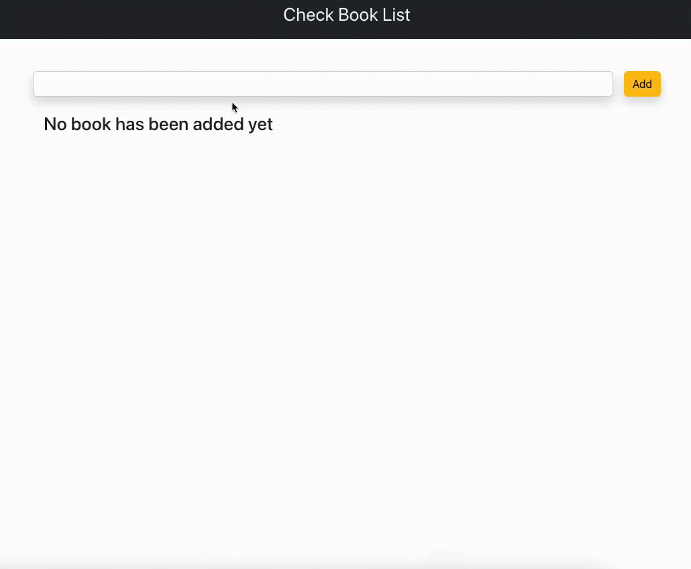

# CrudApp

## Description

It is a crudApp application where the user can list all his books.

With the Edit button, the user can mark the books they have read and update their information again. In the deletion process, a modal is shown and the final decision is taken from the user.

## Used Technologies

- HTML5
- CSS3
- JAVASCRIPT
- REACT.JS

# CrudApp View

